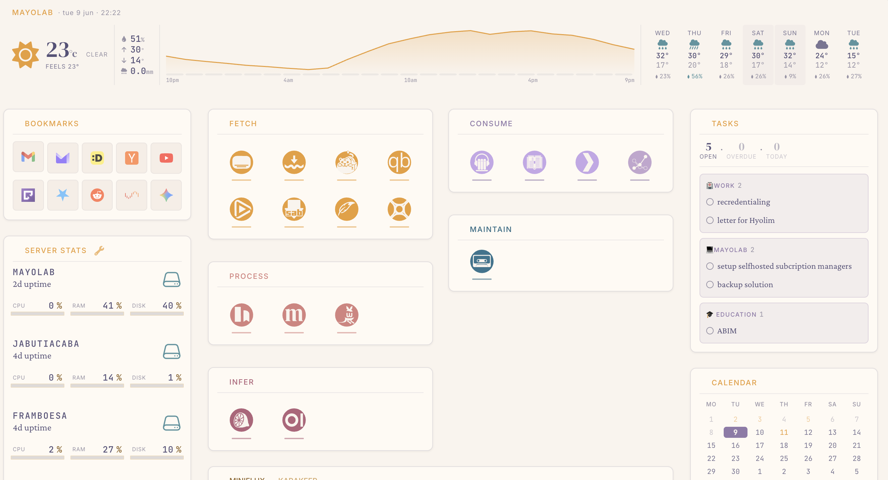

# Dynacat

My custom configuration for [Dynacat](https://github.com/Panonim/dynacat), themed with [Rosé Pine](https://rosepinetheme.com/) and styled with an editorial, calm aesthetic.



---

## What's inside

| Widget | Source | Notes |
|---|---|---|
| **Weather strip** | Tomorrow.io (nowcast/24h) + Open-Meteo (7-day) | Via local caching proxy (`weather-head.yml`) |
| **Weather strip (alt)** | Open-Meteo only | No proxy or API key needed (`weather-head-openmeteo.yml`) |
| **Services** | Docker containers + monitor | Split-column icon grid |
| **Now Playing / Media** | Tautulli | Live sessions + recently added/watched carousels |
| **Feed reader** | Miniflux | Latest unread articles |
| **Bookmarks** | Karakeep | Random or latest, collapsible |
| **Tasks** | TickTick | Per-project cards with due-date chips |
| **Calendar** | CalDAV (Radicale / any server) | 5-week grid + upcoming events |
| **Parcel tracking** | Parcel app | Auto-hides when empty |
| **Pi-hole DNS** | Pi-hole v6 (×2) | Stats + pause buttons |
| **Server stats** | glance-agent | Local + remote hosts |
| **UniFi** | UniFi Network API | WAN status, clients, latency |

---

## Requirements

- **Weather proxy** — required only if using `weather-head.yml` (Tomorrow.io); not needed for `weather-head-openmeteo.yml` (see [Weather setup](#weather-proxy))
- **API proxy** — handles OAuth/session auth for TickTick, CalDAV, and Parcel (see [API proxy](#api-proxy))

---


## Configuration

All user-facing settings live in two places:

- **`.env`** — secrets, endpoints, and credentials (never committed)
- **`options:` blocks** in each widget YAML — behaviour tweaks (collapse count, display limits, tone colours)

### Enabling / disabling widgets

Comment out any `$include` line in `config/dynacat.yml`:

```yaml
# - $include: widgets/unifi.yml      ← disabled
- $include: widgets/pihole.yml
```

### Customising task colours

In `config/widgets/ticktick-tasks.yml`, map each TickTick project ID to a Rosé Pine tone:

```yaml
options:
    tone-abc123def: pine   # House
    tone-xyz789ghi: iris   # Work
```

Get your project IDs from `GET ${API_PROXY_URL}/ticktick/projects`.

Available tones: `iris` `foam` `love` `gold` `rose` `pine`

---

## Proxies

### Weather proxy

Two weather widget variants are available:

**`weather-head-openmeteo.yml`** — calls [Open-Meteo](https://open-meteo.com/) directly (free, no account or proxy needed). Set `WEATHER_LAT` and `WEATHER_LON` in `.env`.

**`weather-head.yml`** — uses Tomorrow.io for higher-resolution nowcast and 24h data, routed through a local caching proxy. Requires a proxy in front of:

| Endpoint | Source |
|---|---|
| `/tomorrow/nowcast` | [Tomorrow.io](https://www.tomorrow.io/) Realtime API |
| `/tomorrow/forecast/24h` | Tomorrow.io Hourly forecast |
| `/openmeteo/forecast` | Open-Meteo daily forecast |

Set `WEATHER_PROXY_URL` in `.env` to the base URL of your proxy instance.

### API proxy

A second proxy handles services that require session auth or OAuth, which Glance widget templates cannot do natively (template requests are GET-only with no ability to store session tokens):

| Endpoint | Service |
|---|---|
| `GET /ticktick/tasks` | TickTick tasks |
| `GET /ticktick/projects` | TickTick projects |
| `POST /ticktick/complete/{proj}/{id}` | Mark task complete |
| `GET /ticktick/habits` | TickTick habits |
| `GET /calendar/events` | CalDAV calendar |
| `GET /deliveries` | Parcel app deliveries |

Set `API_PROXY_URL` in `.env`. 

---


## Design system

Custom CSS lives in `assets/custom/custom.css`. It implements:

- **Rosé Pine** dark and dawn (light) colour palettes — full token set as CSS variables (`--rose-iris`, `--rose-foam`, etc.)
- **Tone cards** — any element with `data-tone="iris|foam|love|gold|rose|pine"` gets matched background, border, and accent colours
- **Font stack** — Crimson Pro (body) · DM Serif Display (large numbers) · Inter (labels/UI) · JetBrains Mono (monospace values)
- **Automatic light mode** via `prefers-color-scheme` and the Glance theme switcher

---

## File structure

```
dynacat/
├── .env.example              ← copy to .env and fill in values
├── .gitignore
├── config/
│   ├── dynacat.yml           ← page layout
│   └── widgets/
│       ├── bookmarks.yml
│       ├── calendar.yml
│       ├── karakeep.yml
│       ├── miniflux.yml
│       ├── parcel.yml
│       ├── pihole.yml
│       ├── server-stats.yml
│       ├── services.yml
│       ├── tautulli.yml
│       ├── ticktick-habits.yml
│       ├── ticktick-tasks.yml
│       ├── unifi.yml
│       ├── weather-head.yml
│       ├── weather-head-openmeteo.yml  ← proxy-free alternative (Open-Meteo only)
│       └── weather.yml       ← alternate sidebar weather widget (disabled by default)
└── assets/
    ├── custom/
    │   ├── custom.css        ← all custom styles
    │   ├── fonts.css
    │   ├── command-palette.js
    │   └── shuffle.js
    └── icons/                ← service icons (SVG/PNG)
```

---

## Credits

- [Dynacat](https://github.com/Panonim/dynacat) by [@Panonim](https://github.com/Panonim) — dashboard engine
- [Rosé Pine](https://rosepinetheme.com/) — colour palette
- [Tomorrow.io](https://www.tomorrow.io/) — weather data
- [Open-Meteo](https://open-meteo.com/) — free 7-day forecast
- [Dashboard Icons](https://dashboardicons.com/) — service icons, adapted using [Affinity](https://affinity.serif.com/)

---

## Built with AI assistance

Most of the code in this repo was written with help from [Claude Code](https://claude.ai/code) by Anthropic. Configuration, custom widgets, proxy logic, and CSS were developed iteratively through conversation — I describe what I want, Claude Code writes or edits the files, and I review and adjust from there.
